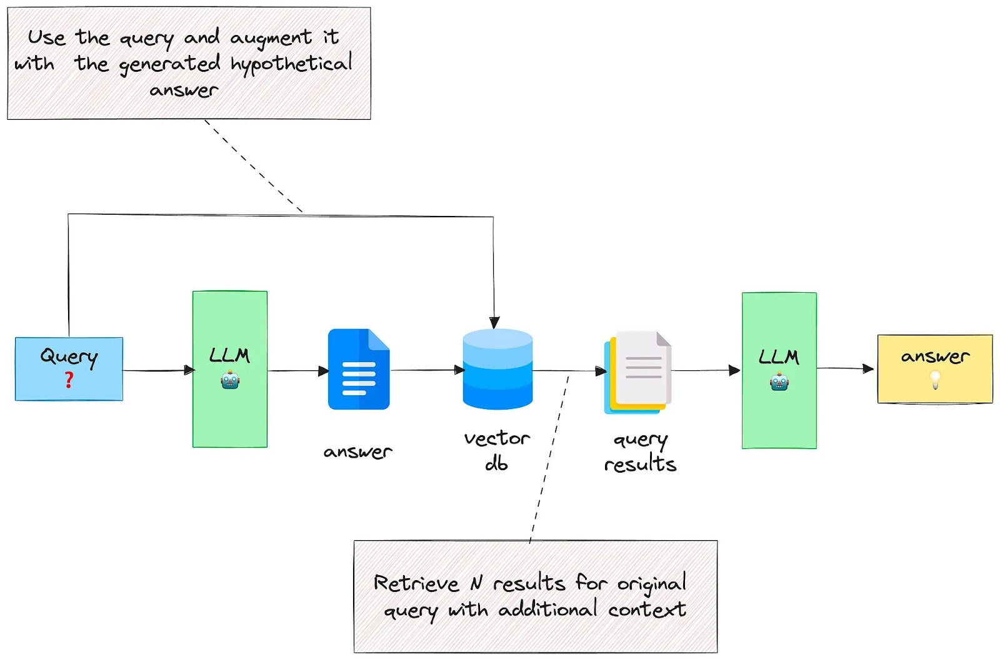

# Simple RAG chatbot for CV
As the name suggests. This is just a simple chatbot that has access to data that includes resume information and some additional bits. 

## How to run this?
If running locally simple run create_and_store_text_embeddings.py and then run app.py. You should see a link in your terminal which should take you to the simple chat app. The chat app layout can be found [here](https://github.com/binary-hood/ChatBot).

## Implementation
Simple implmenetation of query expansion RAG. I like to think of this as one rung above naive RAG. This is shown below. 

You can see several different components in the above image. The query is simply the question being asked. If you check out text_expansion_query.py. This query string is passed to the OpenAI GPT-4.1-nano model (the LLM, which can be changed!) which responds with an answer. The query and naive answer from the LLM is then concatenated. This is then used to query a chroma database which computes the embeddings of the concatonated question and asnwer of  the LLM and returns the N most relevant chunks of text. This along with the original query is passed to the LLM system prompt. The query is then asked again and the LLM should provide a better answer. 

Have a look at create_and_store_text_embeddings to see how the embeddings are created and saved to a chroma database. The test_expansion_query.py will allow you to test a single question. The app.py will start the chat web app.

## Data
Feel free to look at the data folder. Replace it with whatever you want. If you're loading data of a different format you will likely need to change the function that loads the text data. 
